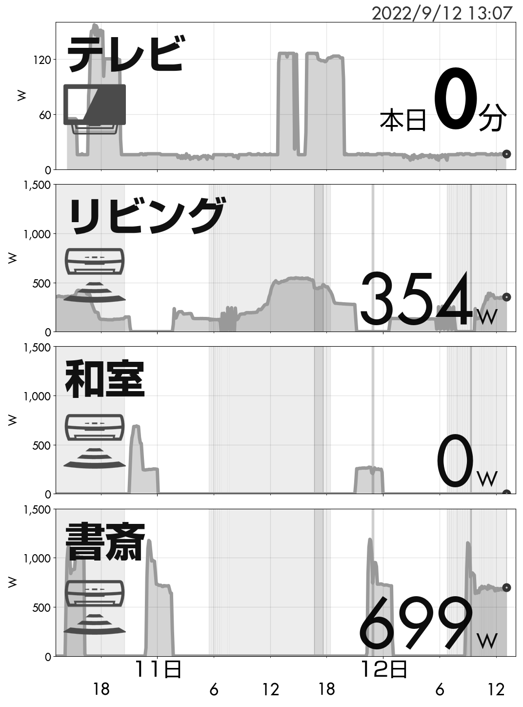

# Kindle power panel

## 概要

Kindle に，下記の情報を表示するためのスクリプトです．

-   1日のテレビの視聴時間
-   エアコンの消費電力

表示サンプルは下記になります．

## 仕組み

大きく次の処理を行います．

-   Influx DB からセンサー情報を取得
-   センサ情報を Matplotlib で描画
-   Kindle に SSH ログインして画像を描画

動かすための設定は，config.yaml に記述します．サンプルを config.example.yaml として登録してありますので参考にしてください．

Influx DB からセンサー情報を取得する部分( sensor_data.py の fetch_data )はお手元の環境に合わせて修正が必要かもしれません．
